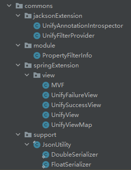

# Java相关封装工具类

##### &emsp;一、返回值包装面板(MVF)【SpringExtension】

[comment]: <> (![github]&#40;https://github.com/cmlx1218/cmlx-collect/blob/master/cmlx-collect-tools/cmlx-collect-commons/MVF.png&#41;)

##### &emsp;二、运营后台查询参数工具类【cms】

##### &emsp;三、异常处理类(包含是否回滚等)【exception】

##### &emsp;四、服务之间远调(head传递等)【feign】

##### &emsp;五、入参校验(注解实现自定义入参校验)【hibernateExtension】

##### &emsp;六、Jsoup简单爬虫(通过网址url爬取网站内容)【jsoup】

##### &emsp;七、加密解密工具【encrypt】

##### &emsp;八、各种类型id生成策略(通过网址url爬取网站内容)【generator】

##### &emsp;九、APP分页包装类【page】

##### &emsp;十、关于二维码相关处理【qrcode】

##### &emsp;十一、数据转excel|excel转数据【excel】

##### &emsp;十二、其他工具类(字符串、流、反射、Json等)【support】